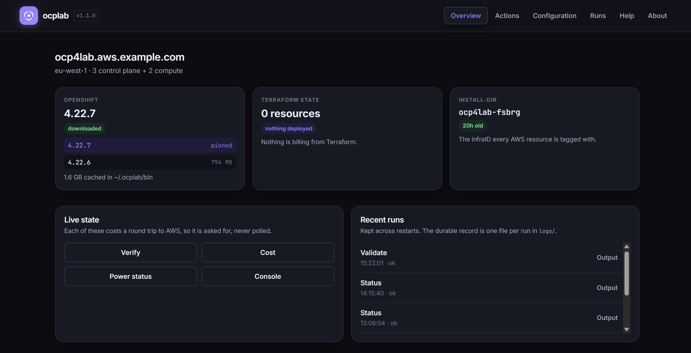

<div align="center">


# ocplab

**OpenShift Container Platform on AWS with user-provisioned infrastructure.**

Terraform owns every AWS resource. The OpenShift installer only generates the
Ignition configs and watches the boot. Not ROSA, not IPI.

</div>

---

`ocplab` drives the whole lifecycle — create, inspect, repair, destroy — from a
single declarative `cluster.yaml`. Everything else (`terraform.tfvars`, the
Ansible variables, `install-config.yaml`) is generated from it.

It has **two front ends over one engine**:

- **A CLI.** `ocplab deploy`, `ocplab verify`, `ocplab destroy`.
- **A local web UI.** `ocplab web start` opens a dashboard, a `cluster.yaml`
  editor that validates before you save, and every operation streaming its
  output live — including Terraform's and the installer's own logs, which the
  CLI can only point you at in another terminal.

Neither is the real one. The UI runs no logic of its own: it executes the same
commands as subprocesses.

<div align="center">
  
</div>

> [!WARNING]
> **This lab costs money while it runs.** Roughly **$0.83–1.06/hour** with
> everything up, plus **$1.12–1.58 of data transfer per deploy** — which for a
> short cycle is the largest charge of all, and the one `ocplab cost` cannot
> see. The normal flow is create → test → destroy the same day.
> `deploy` and `destroy` always confirm before touching anything billable.

---

## Quick start

```bash
git clone https://github.com/LuixyToledo97/openshift-upi-aws.git
cd openshift-upi-aws

./ocplab prereqs                 # what you need by hand, before anything else
./ocplab setup                   # project venv + Ansible collections
source .venv/bin/activate

./ocplab init --minimal          # writes cluster.yaml — edit it
./ocplab validate                # every error at once, not just the first
./ocplab bootstrap apply         # one-time AWS prerequisites
./ocplab preflight               # read-only: credentials, DNS, AMI

./ocplab deploy                  # ~40 minutes
./ocplab verify                  # nodes Ready, ClusterOperators healthy
./ocplab destroy                 # the only thing that stops the bill
```

Or drive all of it from the browser:

```bash
./ocplab web start               # background service; prints a local URL
```

---

## What it does

| | |
|---|---|
| **One source of truth** | `cluster.yaml` generates the Terraform vars, the Ansible vars and `install-config.yaml`. Nothing is edited twice. |
| **Pinned versions** | `openshift.version` pins the installer, the client **and** the RHCOS AMI, cached under `~/.ocplab/bin/`. |
| **Points `oc` at your cluster** | Activating the venv exports `KUBECONFIG`, so a hand-typed `oc delete` cannot land on a leftover Docker Desktop context. |
| **Spot instances** | For compute and bootstrap. Never the control plane — `validate` refuses it, and the reason is in [Profiles](docs/profiles.md). |
| **Repairs itself** | `ocplab repair` recreates a reclaimed worker and approves its CSRs, refusing any plan that is not purely additive. |
| **Knows what it costs** | `ocplab cost` prices what is actually deployed, live, Spot at the Spot rate. |
| **Tears down cleanly** | Ordered teardown that handles the resources the cluster creates behind Terraform's back. |
| **A cost safety net** | Budget, budget action and a killswitch Lambda, outside Terraform so it survives a broken destroy. |

---

## Documentation

| | |
|---|---|
| [Prerequisites](docs/prerequisites.md) | Local machine, AWS account, Red Hat pull secret, DNS delegation |
| [Architecture](docs/architecture.md) | Topology, components, install flow, repository layout, the Terraform files |
| [Profiles](docs/profiles.md) | **standard vs minimal** — topology, config and cost, side by side |
| [The CLI and `cluster.yaml`](docs/cli.md) | Every command, and the full config schema |
| [The web UI](docs/web-ui.md) | The dashboard, the editor, the output panel, and how it stays safe |
| [Deploying and destroying](docs/lifecycle.md) | What each stage does, how long it takes, and manual cleanup if it fails |
| [Costs](docs/costs.md) | The real numbers, measured, and the safety net |
| [Troubleshooting](docs/troubleshooting.md) | The traps that cost the most debugging time |

`CLAUDE.md` at the root is the same material aimed at an AI coding assistant:
architecture, standing rules, and the non-obvious constraints behind them.

---

## ✅ Tested versions

`ocplab versions list` shows everything the mirror publishes. That is not the
same as everything that has been *tried*. This table is the honest answer:

| Version | Status | Last verified | Notes |
|---|---|---|---|
| **4.22.6** | ✅ Verified | 2026-08-03 | Several full cycles. One bootstrap failure that did not reproduce (see below) |
| **4.22.7** | ✅ Verified | 2026-08-04 | Re-verified end to end, this time driven entirely from the web UI: deploy, `verify` at 5/5 Ready and 27 healthy ClusterOperators, `cost`, and a `destroy` that completed in 12m10s leaving nothing behind. The earlier run needed a second `destroy`, for a bug that was not version-specific and is now fixed |
| Anything else | ⚪ Untested | — | Nothing prevents it, nothing confirms it |

**"Verified" means a real end-to-end run against AWS**: `deploy` →
`verify` reporting every node Ready and every ClusterOperator healthy → `ssh`
onto a node → `destroy` leaving nothing behind. Not "the binary downloaded",
and not "terraform applied".

**Why so few.** The four traps documented in `CLAUDE.md` — the `owned` cluster
tag, etcd DNS discovery, the private zone shadowing the public one, and the
ingress teardown ordering — were each found the hard way against 4.22. Nothing
says they still apply unchanged on another minor, and nothing says a new one
hasn't appeared. Until somebody runs it, "should work" is a guess.

**The one failure worth knowing about**: on 2026-08-02 a 4.22.6 deploy died
with the bootstrap's `kube-apiserver` crashlooping on its `rbac/bootstrap-roles`
PostStartHook. A clean retry the same afternoon reached
`bootstrap-success` with no crashloop at all, so it was transient rather than a
property of that version. Recorded because "it worked for me" is more useful
with the exceptions attached.

**And the one on 4.22.7**: `destroy` failed with `DependencyViolation` on the
internet gateway, because the ingress-operator had recreated the router's ELB
after the teardown deleted it — a latent bug that earlier teardowns had simply
raced past, not anything to do with the version. A second `ocplab destroy`
cleaned it up (the role is idempotent, which is why re-running is the
documented response), and the operators are now stopped before the
IngressController is deleted so the race can't happen.

Timings were within seconds of 4.22.6 across every phase, which is the boring
result you want from a version bump.

**If you run another version successfully**, a PR adding a row here is a
genuinely useful contribution — more so than most code.

---

## ⚡ Quick reference

### 🆕 Deploy from scratch

```bash
cd ~/openshift-upi-aws
source .venv/bin/activate
./ocplab preflight
./ocplab deploy
```

### 💥 Destroy

```bash
cd ~/openshift-upi-aws
./ocplab destroy
```

### ℹ️ Cluster info

```bash
./ocplab console          # console URL + kubeadmin password
./ocplab status           # install-dir age, Terraform resource count, where oc points
eval "$(./ocplab env)"     # point this shell's oc/kubectl at the cluster
jq -r .infraID install-dir/metadata.json
```

### 🔄 Updating the RHCOS AMI

`ocplab render` auto-discovers the current AMI for `platform.aws.region`
whenever `cluster.yaml`'s `openshift.rhcosAmi` is unset — just run it again
to pick up a newer one:

```bash
./ocplab render
```

To pin a specific AMI instead (e.g. to freeze a known-good version), set it
explicitly:

```bash
openshift-install coreos print-stream-json | \
  jq -r '.architectures.x86_64.images.aws.regions["eu-west-1"].image'
# copy the value into cluster.yaml -> openshift.rhcosAmi, then:
./ocplab render
```

### 👷 Changing the number of workers

```bash
# cluster.yaml -> compute.replicas
./ocplab render
cd terraform && terraform apply -auto-approve
# afterward, approve the CSRs of the new nodes — ./ocplab deploy re-running
# also handles this via the finalize role
```

---

---

## 📚 References

- [OpenShift Container Platform documentation](https://docs.redhat.com/en/documentation/openshift_container_platform)
- [openshift/installer — AWS IAM permissions](https://github.com/openshift/installer/blob/main/docs/user/aws/iam.md)
- [Red Hat pull secret](https://console.redhat.com/openshift/install/pull-secret)
- [Terraform AWS Provider](https://registry.terraform.io/providers/hashicorp/aws/latest/docs)
- [AWS pricing calculator](https://calculator.aws)

---

---

## 🤝 Contributing

Contributions are welcome! This started as a personal lab, but anyone is
free to:

- 🐛 Open an issue to report a bug, ask a question, or suggest an improvement
- 🔀 Fork the repository and adapt it to your own needs
- 📬 Submit a pull request with a fix, a new feature, or a better approach

Whether it's a small typo fix or a bigger idea, all contributions are
genuinely appreciated. Check [BACKLOG.md](BACKLOG.md) for what's already
planned — a good starting point if you're looking for something to pick up.

---

---

## 👤 Author

🧑‍💻 **Name:** Luis Garcia

☁️ **Role:** Cloud Native Engineer

🐙 **GitHub:** [@LuixyToledo97](https://github.com/LuixyToledo97)

💼 **LinkedIn:** [lgv-rhca](https://www.linkedin.com/in/lgv-rhca/)

✍️ **Medium:** [@luixytoledo97](https://luixytoledo97.medium.com/)

---

---

## 📄 License

MIT — see [LICENSE](LICENSE).
