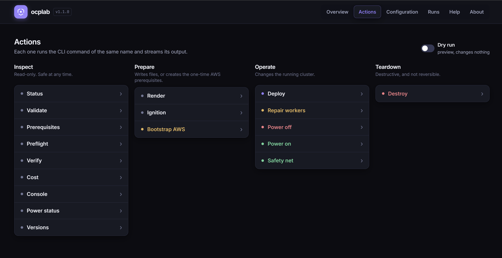
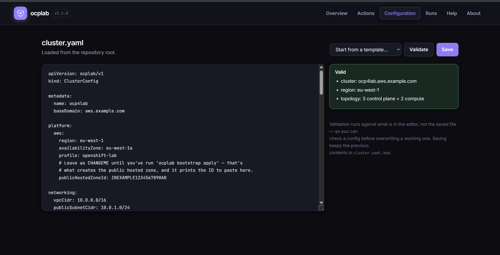
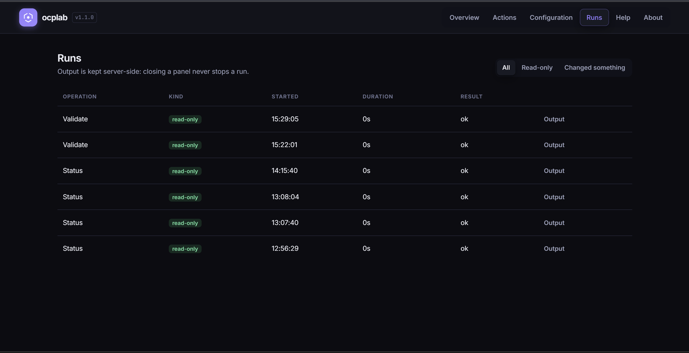
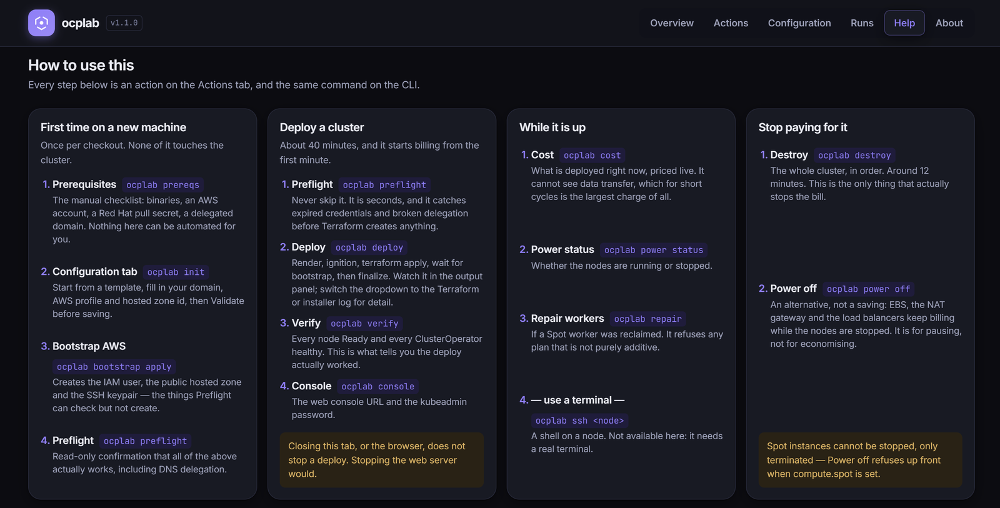
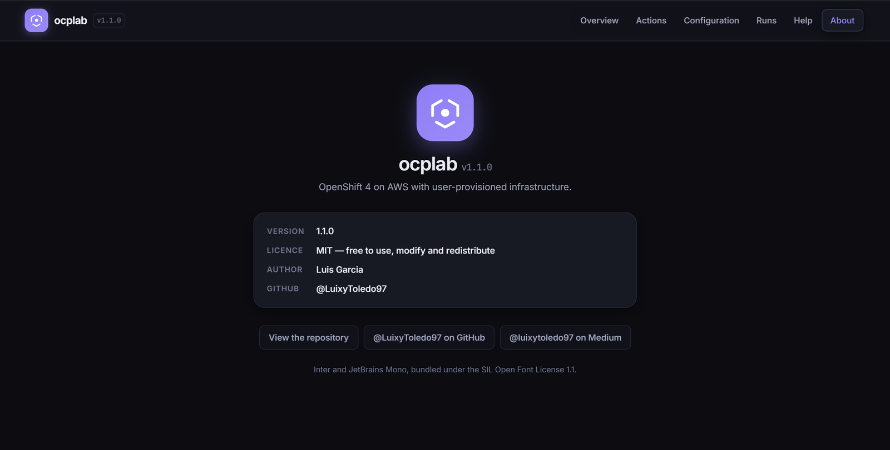

# The web UI

> Part of the [ocplab](../README.md) documentation.

## 🖥️ The web UI

Everything the CLI does, in a browser: a dashboard, a `cluster.yaml` editor
with live validation, and every operation with its output streaming as it
happens.

```bash
source .venv/bin/activate
./ocplab web start
```

It runs **in the background and gives you your shell back** — closing the
terminal doesn't stop it. `ocplab web status` reprints the URL with its token,
`ocplab web stop` shuts it down, and `--port` moves it off 8770.

`start` checks its prerequisites first and **starts nothing if any are
missing**, reporting all of them at once rather than one per attempt:

```
Cannot start the web UI — 2 problem(s):

  - 'cluster.yaml' does not exist. Run 'ocplab init' (or 'ocplab init --minimal')
    to create one — every view in the UI reads it.
  - port 8770 on 127.0.0.1 is already in use. Stop whatever is listening, or
    pick another with --port.

Nothing was started.
```

It requires `cluster.yaml` to *exist*, but deliberately does not require it to
be **valid** — the Configuration editor is how you fix a broken one, so
refusing to start over a config error would lock you out of the tool that
repairs it.

**It is a second thin layer, not a second program.** The server never talks to
AWS and never reads Terraform state — it runs `ocplab <command>` as a
subprocess and shows you that command's own output. Whatever the CLI does, the
UI does, because it *is* the CLI.

## The six views

### Overview


What version is pinned and whether it is downloaded, what Terraform holds, how
old `install-dir` is, and — only when it points somewhere else — where your
`oc` is aimed. Nothing on this page needs a command run first: it is all local
and instant, which is what makes it safe to poll. Live state sits behind the
four buttons, because each of those costs a round trip to AWS.

### Actions



Grouped by how much damage each one can do, and tinted to match: red destroys,
amber changes something you may not get back, green restores. Descriptions fold
away behind the chevron so the page stays scannable — and the chevron is a
separate control from the row that runs the command, because one button that
both explains and fires is a button people hesitate over.

### Configuration



The `cluster.yaml` editor. **Validate runs against what is in the editor, not
the saved file**, so a config can be checked before it overwrites a working
one — and it reports every error at once rather than stopping at the first.
Saving keeps the previous contents in `cluster.yaml.bak`.

### Runs



Filterable by whether an operation was read-only or actually changed something.
Kept across restarts of the server: the metadata lives in `logs/runs.json`, and
a run recorded by an earlier server replays from its own log file rather than
from lines nobody kept.

### Help



The workflows written out — first run, deploy, day to day, and stopping the
bill — each step naming both the action and the CLI command, since neither is
the real one.

### About



The version, read from `ocplab --version` rather than hardcoded so the two
cannot drift, the licence, and the author's links.

The output panel appears when you run something, docks to the bottom or the
right, and is drag-resizable; it reserves space rather than covering the page,
and remembers where you put it. Closing it never stops the run.

Its dropdown switches what the panel is showing: the run's own output, or any
log file being tailed live — including Terraform's resource-by-resource detail
and the OpenShift installer's own log. During a deploy that is the difference
between reading "terraform apply, 5m47s" and watching the resources appear,
and it saves the second terminal the CLI otherwise sends you to.

Three things worth knowing:

- **It only ever listens on `127.0.0.1`, and there is no flag to change that.**
  This server holds your AWS credentials and can create and destroy real
  infrastructure. It also refuses any request whose `Host` header isn't
  loopback, which stops a page you happen to be visiting from pointing a DNS
  name at `127.0.0.1` and driving it through your browser. Every API call needs
  a token that is minted fresh on each start, so the URL is not worth sharing —
  it dies with the server.
- **One operation at a time.** There is one cluster and one Terraform state;
  two concurrent applies is how you corrupt it. Starting a second operation
  while one runs is refused, with the reason.
- **Closing the tab does not stop the run.** Output is kept server-side, so
  reloading — or opening the page forty minutes into a deploy — replays
  everything and then follows live. The durable record is still the plain-text
  file per run under `logs/`, written by the Ansible callback and completely
  independent of this UI.

**`ocplab ssh` is not there**, and won't be: it hands the terminal over, which
a browser has nowhere to put — and a web terminal would hand anyone who
reached this server a root shell on your nodes. Run it from a shell. `env`,
`init` and `setup` are absent too, for duller reasons the UI explains on the
page.

There is no build step and no new dependency: a stdlib HTTP server, and plain
HTML, CSS and JavaScript you can read on GitHub. The two fonts it uses are
bundled rather than fetched (176 KB, SIL Open Font License — see
[`web/static/fonts/README.md`](../web/static/fonts/README.md)), so it renders
identically everywhere and works with no internet at all, which is plausibly
the situation when the cluster you are fixing *is* the problem.

---
